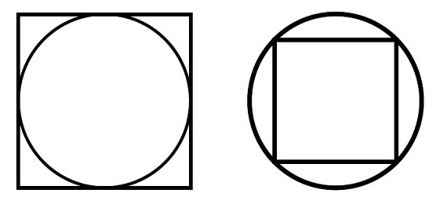

# Stroke

[[toc]]

---

You can customize the stroke behavior of most the tool brushes.
The settings should be fairly similar to the ones present in 2d painting application.

However some option are specific to the sculpting and 3d field.

## Alpha
The `Alpha` is a texture that will modulate your brush behavior.
It's a greyscale image, where black pixels means no deformation and white pixels full deformation.

For now the texture is never resized, so beware that huge image can slow down the performance a bit.

### Invert value
Use this option if the pattern is upside-down when you sculpt

### Alpha scale
Use this option to scale the alpha pattern.

At maximum value, the brush radius (circle) is inside the alpha square (left image).

At minimum value, the alpha square is inside the tool circle radius (right image).

## Falloff
This is similar to the [Alpha](#alpha), except that you drive the intensity with a single curve.
when the curve is on the top, this is full deformation, when it's at the bottom the brush has no effect.

::: tip Symmetrical curve
The curve is always symmetric, but if you go in the [Interface](interface.md) menu, you can choose to only display the left part of the curve.

It doesn't change the behavior of the falloff, this is mostly for convenience.
:::

## Stroke Type

By default, most brushes are using the `Dot` stroke type.
`Dot` means that several instances of the brush will happen at regular interval when you sculpt.
You can customize the [Dot behavior](#dot-settings).

| Menu                     | Description  |
| :---:                    | :---:        |
| Dot                      | Default stroke type    |
| Grab - dynamic radius    | Stamp-style where you change the radius by dragging |
| Grab - dynamic intensity | Stamp-style where only the intensity can be modulated |

<video width='360' preload='metadata' poster='./videos/stroke_type.jpg' controls>
    <source src='./videos/stroke_type.mp4' type='video/mp4'>
</video>

::: tip
You can get interesting result by using `Grab - dynamic radius` along with the [Move](tools.md#move) or [Drag](tools.md#drag) tools.
:::

### Dot settings

#### Adjust spacing intensity
Adjust the brush intensity to ensure consistent deformation depending on the stroke spacing.

#### Stroke spacing
Spacing between each stroke, relative to the tool radius.
Lower value will allow smoother stroke but overall performance will decrease.

#### Dragging distance
The stroke will lag behind the pointer position according to a certain distance.

This can be useful if you want to be follow precisely a path in a smooth way.

#### Stroke smoothing
Average multiple pointer position to get a smoother stroke.
With high values, the stroke will lag behind the pointer but will eventually catch up.

It can also be useful for drawing smooth lines.

####
Snap the stroke if the pointer lies close to the last recorded stroke.

This is useful if you want to draw a long continuous line in several strokes.

## Advanced

### Accumulate stroke
If this option is enabled, there is no limit to how much matter you can add/remove per stroke.

### Connected topology 
This option will only sculpt the vertices that are linked to the picked surface.
This is typically used for the Move tool, for example if you want to exclusively move a part that self-intersect with another part.

<video width='360' preload='metadata' poster='./videos/connected_topology.jpg' controls>
    <source src='./videos/connected_topology.mp4' type='video/mp4'>
</video>

### Front-facing vertex only
This option will ignore back facing vertices.
It can be useful if you want to paint part of a thin geometry without impacting the other side.
It also works for sculpting but you might experience some artefacts.

### Allow Dynamic Topology
This option is only available if your mesh is in [Dynamic Topology](topology.md#dynamic-topology) mode.
You can disable or enable the refinment for a specific tool.
